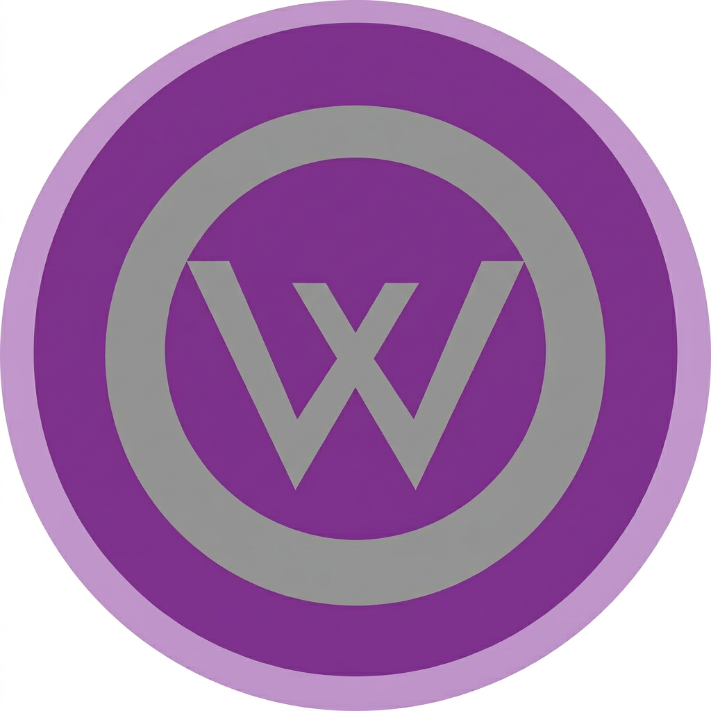

<div align="center">



# PhoneFlash

**Transfer files between your Android phone and Windows PC over USB**

No root. No Wi-Fi. No cloud. Just USB.

[](https://github.com/ren10-14/PhoneFlash/releases)
[](LICENSE)
[]()
[]()

[**Download**](https://github.com/ren10-14/PhoneFlash/releases) · [**How to Install**](HOWINSTALL.md)

</div>

---

## What is PhoneFlash?

PhoneFlash lets you browse, download, upload, and preview files on your Android phone directly from your Windows PC — using only a USB cable.

No Wi-Fi, no internet, no cloud storage, no root access needed. Just plug in your phone and go.

---

## Features

- 📁 **Browse phone files** — navigate folders, see sizes and dates
- ⬇️ **Download files** — single file or multi-select with Ctrl+Click
- ⬆️ **Upload files** — transfer files from PC to phone
- 🖼️ **Image preview** — view photos without downloading
- 🎬 **Built-in video player** — watch videos directly
- 🎵 **Built-in audio player** — listen to music and audio
- 🔌 **USB only** — works without Wi-Fi or internet
- 🔒 **No root required** — works on any Android 7.0+
- 🎨 **Dark & Light themes** — modern desktop UI
- 📦 **Portable** — extract, run, done. No installation.

---

## Quick Start

### 1. Phone

- Enable USB Debugging ([how?](HOWINSTALL.md#step-1-enable-developer-options))
- Install [PhoneFlash.apk](https://github.com/ren10-14/PhoneFlash/releases)
- Open the app → grant permissions → tap **Start Server**

### 2. PC

- Download [PhoneFlash-Windows.zip](https://github.com/ren10-14/PhoneFlash/releases)
- Extract to any folder
- Run `PhoneFlash.exe`
- Click **Connect**

### 3. Done!

Browse files, download, upload, preview images, play media.

> For detailed step-by-step instructions, see [**How to Install**](HOWINSTALL.md).

---

## How It Works
┌──────────────┐ USB Cable ┌──────────────┐
│ │◄───────────────────►│ │
│ Windows PC │ ADB Port Forward │ Android │
│ PhoneFlash │◄───────────────────►│ PhoneFlash │
│ (Client) │ TCP over USB │ (Server) │
│ │ │ port 8888 │
└──────────────┘ └──────────────┘

1. The Android app starts a TCP server on port 8888
2. The PC app uses ADB to forward `tcp:8888` over USB
3. PC connects to `127.0.0.1:8888` — ADB tunnels traffic to the phone
4. Commands are exchanged as JSON over a binary protocol
5. Files are transferred in 1 MB chunks

---

## Requirements

| | Minimum |
|---|---|
| **PC** | Windows 10 or 11 |
| **Phone** | Android 7.0+ |
| **Cable** | USB data cable (not charge-only) |
| **Phone setting** | USB Debugging enabled |

---

## Downloads

Go to [**Releases**](https://github.com/ren10-14/PhoneFlash/releases) and download:

| File | What it is |
|---|---|
| `PhoneFlash-Windows.zip` | PC app — extract and run `PhoneFlash.exe` |
| `PhoneFlash.apk` | Android app — install on your phone |

---

## Project Structure
PhoneFlash/
├── main.py # Entry point
├── app.py # App initialization
├── settings.json # User settings
├── core/
│ ├── adb_manager.py # ADB process management
│ ├── phone_client.py # TCP protocol client
│ ├── connection_manager.py # Connection lifecycle
│ ├── file_transfer.py # Chunked file transfer
│ └── settings_manager.py # Settings I/O
├── preview/
│ ├── image_preview.py # Image preview loader
│ ├── video_player.py # Built-in video player
│ └── audio_player.py # Built-in audio player
├── ui/
│ ├── main_window.py # Main window
│ ├── settings_dialog.py # Settings dialog
│ └── theme.py # Dark / Light themes
└── resources/
├── PhoneFlash.ico # App icon
└── adb/ # Bundled ADB
├── adb.exe
├── AdbWinApi.dll
└── AdbWinUsbApi.dll

---

## Tech Stack

| Component | Technology |
|---|---|
| PC app | Python, PySide6 (Qt 6) |
| Android app | Kotlin |
| Transport | TCP over ADB USB forwarding |
| Protocol | 4-byte length header + JSON + binary data |
| Packaging | PyInstaller |

---

## Building from Source

If you want to build the PC app yourself:

```bash
git clone https://github.com/ren10-14/PhoneFlash.git
cd PhoneFlash
pip install PySide6 pyinstaller
Download Android SDK Platform Tools, copy adb.exe + DLLs to resources/adb/.

Build EXE:

Bash

pyinstaller --noconfirm --windowed --name PhoneFlash --add-data "resources;resources" --add-data "settings.json;." --hidden-import PySide6.QtMultimedia --hidden-import PySide6.QtMultimediaWidgets main.py
Output: dist/PhoneFlash/PhoneFlash.exe

License
This project is open source. See LICENSE for details.

ADB is part of Android SDK Platform Tools by Google, distributed under the Apache License 2.0.

<div align="center">
Made with ❤️ for simple file transfer

Download · How to Install · Report Issue

</div> ```
